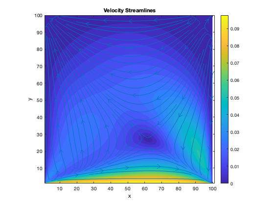
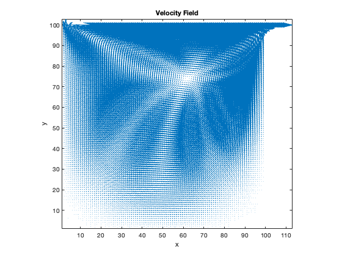
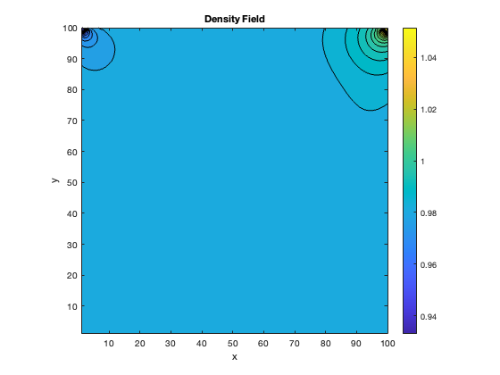
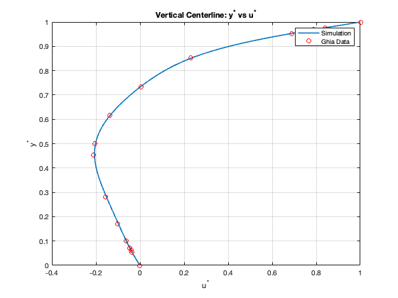
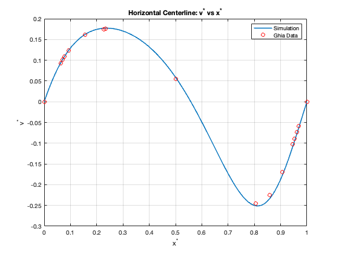

# Lid-Driven Cavity Flow

## Description

This project implements a D2Q9 lattice Boltzmann solver for the lid-driven cavity flow benchmark at Reynolds number 100. The code includes both single-relaxation-time (SRT/BGK) and multiple-relaxation-time (MRT) collision models through the `F_C` collision selector in `CavityFlow.m`.

Features:
- D2Q9 lattice
- SRT/BGK collision model
- MRT collision model with selectable relaxation cases
- Moving-lid boundary condition
- No-slip stationary walls
- Streamline, velocity, density, and Ghia benchmark comparison plots

## Governing Equations

Macroscopic density:

rho = sum(f_i)

Macroscopic velocity:

u = sum(f_i e_i) / rho

MRT collision:

f* = M^-1 [m - S(m - m_eq)]

## Collision Model Selection

The `F_C` flag controls which collision model is used:

- `F_C = 0`: SRT/BGK collision
- `F_C = 1`: MRT collision

When MRT is selected, the `case_id` switch updates the diagonal relaxation matrix `S` so different relaxation-rate cases can be tested without rewriting the solver.

## Results

### Velocity Streamlines

### Velocity Field

### Density Field

### Vertical Centerline Comparison

### Horizontal Centerline Comparison

## Files

- CavityFlow.m
- eqm_d2q9.m
- moment_rho_u_d2q9.m
- plot_streamlines.m
- LidDrivenCavityFlow_MRT_DensityField.png
- LidDrivenCavityFlow_MRT_VeloStrmlines.png
- LidDrivenCavityFlow_MRT_VelocityField.png
- LidDrivenCavityFlow_VertCenterline_DataComp_MRT.png
- LidDrivenCavityFlow_HoriCenterline_DataComp_MRT.png

## Skills Demonstrated

- MATLAB
- Computational Fluid Dynamics
- Lattice Boltzmann Method
- SRT/BGK Collision Modeling
- MRT Collision Modeling
- Boundary Conditions
- Benchmark Validation
