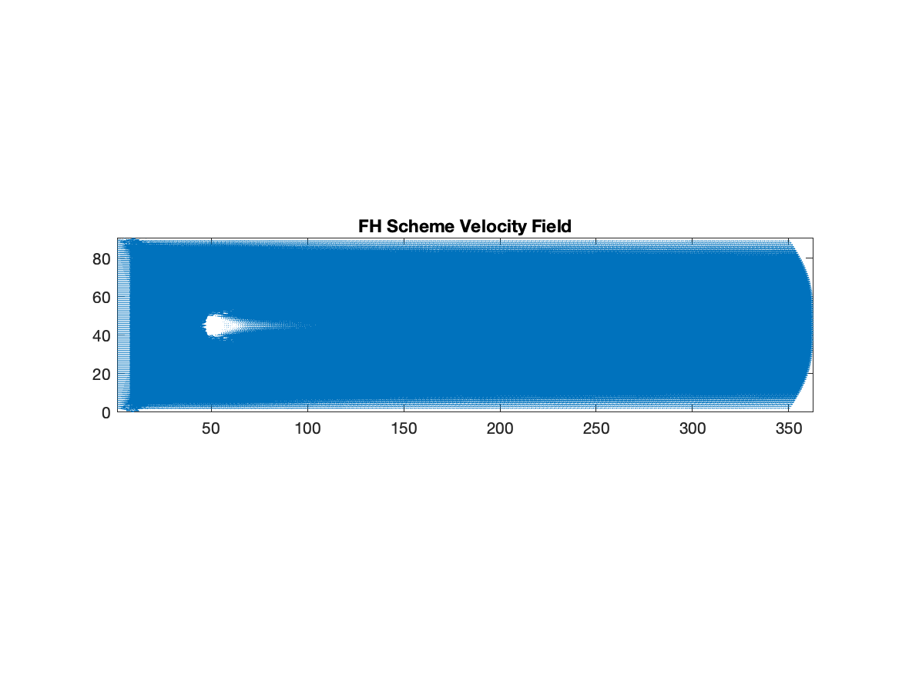
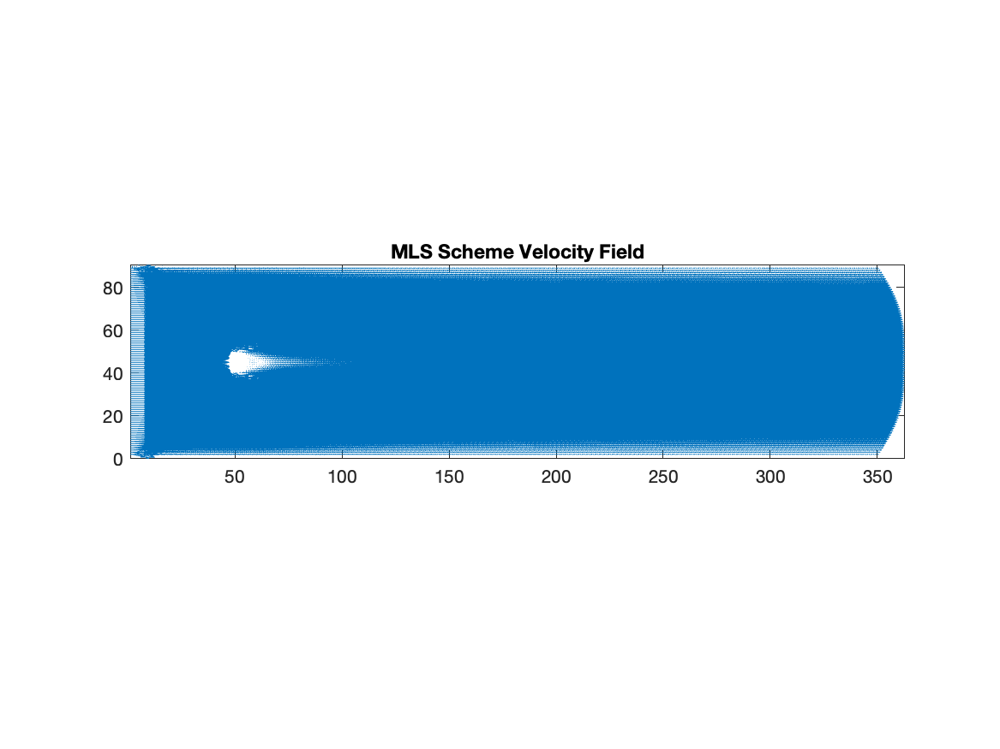
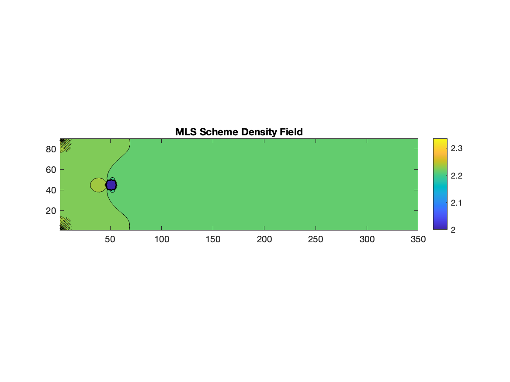
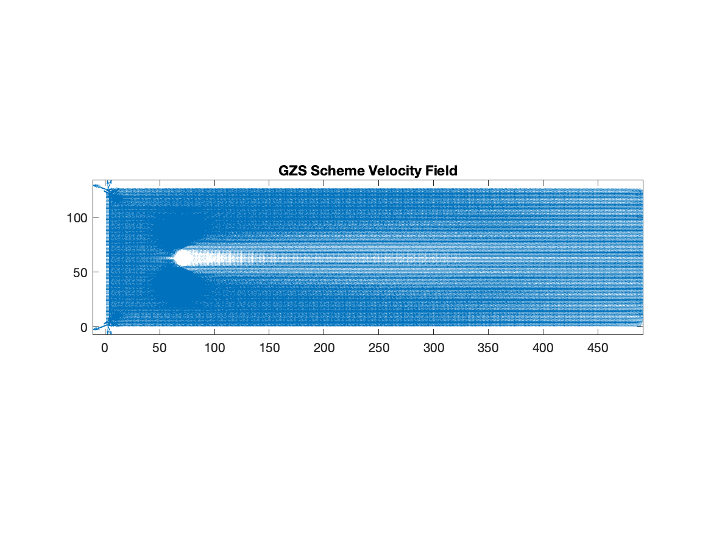
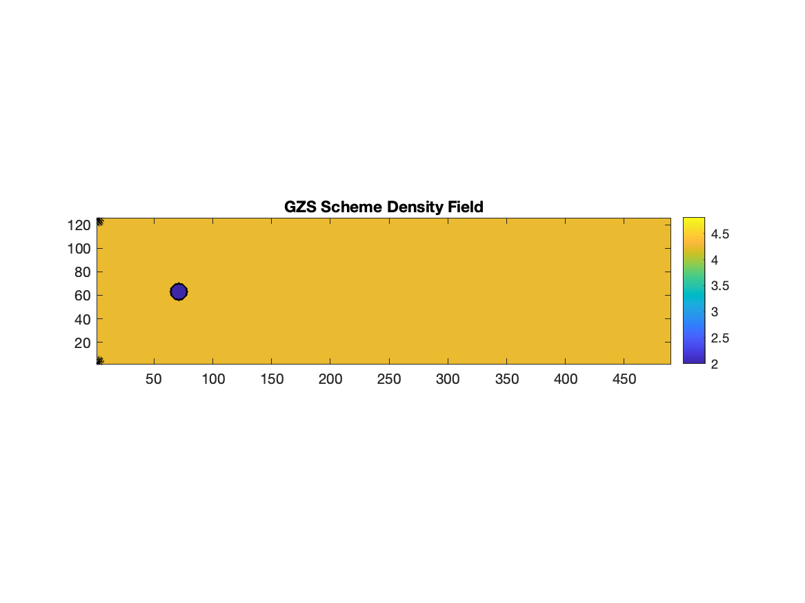

# Curved Boundary Schemes

## Description

This folder compares three lattice Boltzmann curved boundary treatments for flow around a circular cylinder:

- FH scheme
- MLS scheme
- GZS scheme

The GZS implementation uses the second version from `MADAL_v2` and is included here as `GZS_Scheme.m` so its filename matches the FH and MLS naming pattern.

## Accuracy Note

Among the three tested boundary treatments, GZS was identified as the most accurate scheme.

## 10,000 Iteration Results

The plots below were generated after running each scheme for 10,000 iterations.

### FH Scheme

### MLS Scheme

### GZS Scheme

## Included Schemes

### FH Scheme

`FH_Scheme.m` implements the FH curved boundary approach for the circular cylinder case.

### MLS Scheme

`MLS_Scheme.m` implements the MLS curved boundary approach for the same circular cylinder geometry.

### GZS Scheme

`GZS_Scheme.m` contains the second-version GZS implementation from `GZS_V2.m`.

## Shared Helper Files

- eqm_d2q9.m
- moment_rho_u_d2q9.m
- test_circle.m
- find_the_wall_point.m

## Skills Demonstrated

- MATLAB
- Computational Fluid Dynamics
- Lattice Boltzmann Method
- Curved Boundary Conditions
- Cylinder Flow Simulation
- Boundary Scheme Comparison
