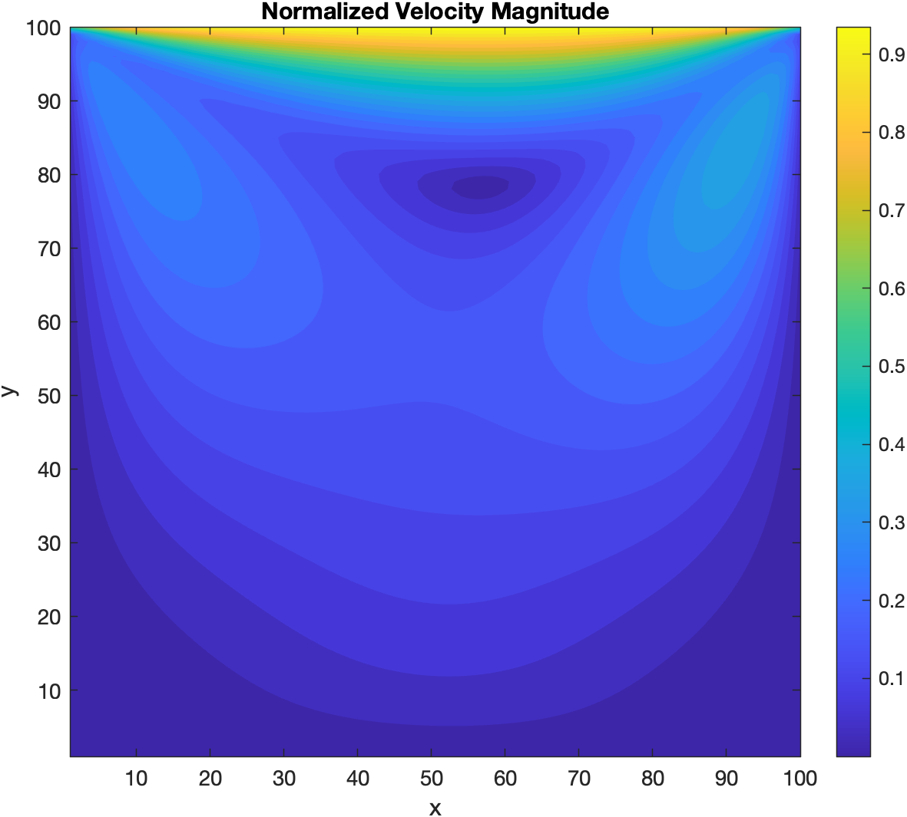
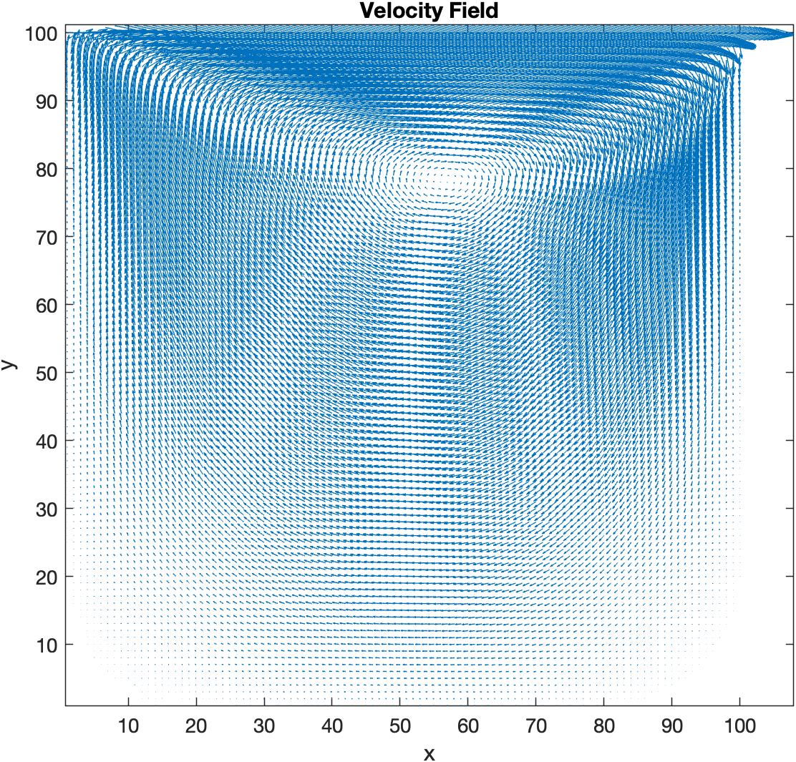
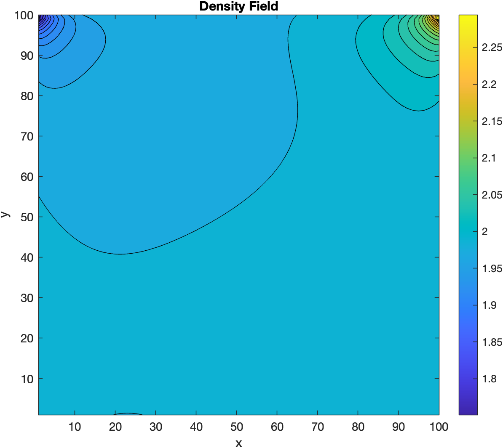
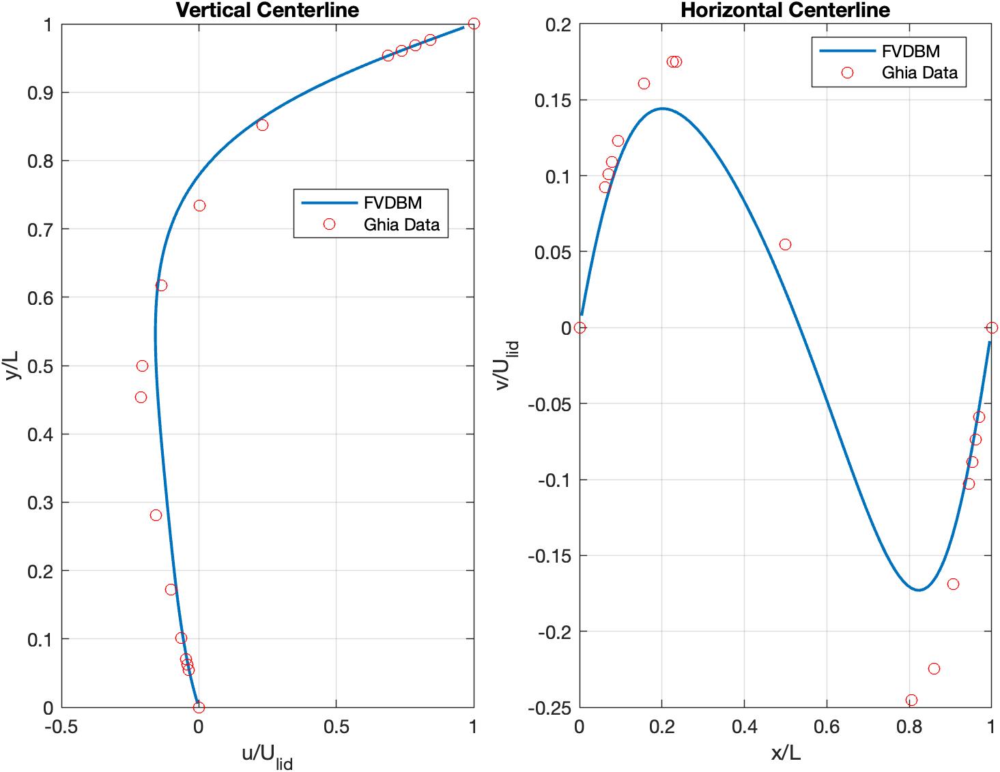
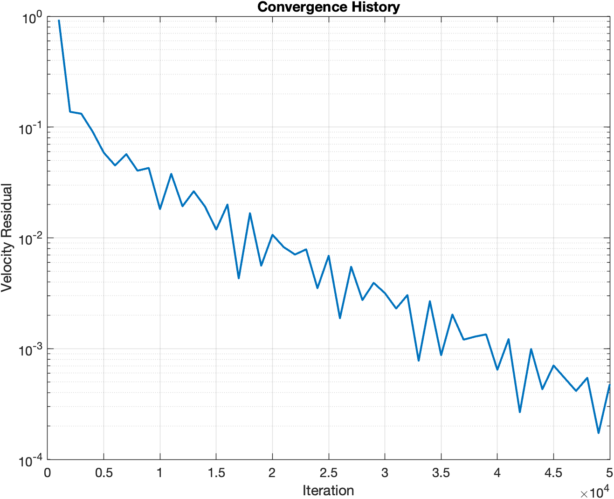

# Finite-Volume Discrete Boltzmann Method

## Description

This project implements the author's original D2Q9 finite-volume discrete Boltzmann method (FVDBM) for the lid-driven cavity flow benchmark at Reynolds number 100. The MATLAB solver uses cell-centered control volumes, first-order upwind face fluxes, BGK collision, and non-equilibrium extrapolation at the cavity walls.

Features:
- D2Q9 discrete velocity model
- Cell-centered finite-volume discretization
- First-order upwind face fluxes
- BGK collision model
- Moving-lid and no-slip wall boundary conditions
- Low-Mach and explicit time-step stability checks
- Ghia centerline benchmark comparison
- Automatic velocity, density, and convergence plots

## Governing Equation

The discrete distribution functions satisfy:

df_i/dt + xi_i . grad(f_i) = -(f_i - f_i^eq) / tau

Macroscopic density and velocity are recovered from:

rho = sum(f_i)

u = sum(f_i xi_i) / rho

## Numerical Setup

The default case uses:

- Reynolds number: `Re = 100`
- Domain length: `L = 100`
- Grid: `100 x 100` control volumes
- Lid velocity: `U_lid = 0.1333`
- Iterations: `50000`

The saved case completed 50,000 iterations in approximately 3,697 seconds with a final 1,000-step velocity residual of `4.77e-4`. Mean absolute centerline errors relative to Ghia et al. are `0.01882` for `u/U_lid` and `0.02196` for `v/U_lid`.

## Results

### Velocity Magnitude

### Velocity Field

### Density Field

### Centerline Benchmark Comparison

### Convergence History

## Files

- `FVBDM_v2.m`
- `eqm_d2q9.m`
- `moment_rho_u_d2q9.m`
- `FVBDM_results.mat`
- `velocity_magnitude.png`
- `velocity_vectors.png`
- `density_field.png`
- `centerline_comparison.png`
- `convergence_history.png`

## Reference

U. Ghia, K. N. Ghia, and C. T. Shin, "High-Re solutions for incompressible flow using the Navier-Stokes equations and a multigrid method," Journal of Computational Physics, vol. 48, no. 3, pp. 387-411, 1982.

## Skills Demonstrated

- MATLAB
- Computational Fluid Dynamics
- Finite-Volume Method
- Discrete Boltzmann Method
- BGK Collision Modeling
- Boundary Conditions
- Benchmark Validation
