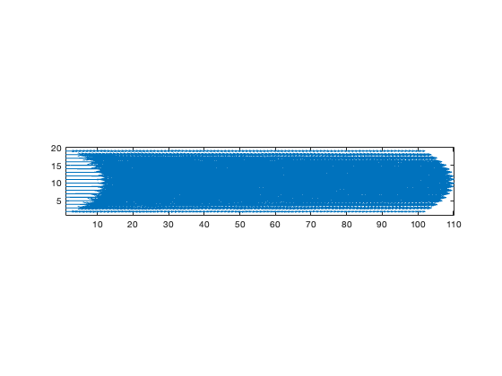
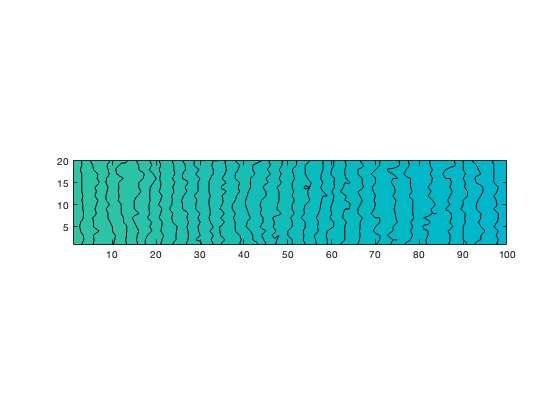

# LBM-CFD-Projects

A portfolio of lattice Boltzmann CFD simulations written in MATLAB.

---

# Poiseuille Flow

## Description

This project implements a D2Q9 lattice Boltzmann solver for pressure-driven channel flow.

Features:
- D2Q9 lattice
- BGK collision operator
- Velocity inlet boundary condition
- Zero-gradient outlet condition
- No-slip walls

## Governing Equations

Macroscopic density:

ρ = Σfᵢ

Macroscopic velocity:

u = (Σfᵢeᵢ)/ρ

BGK collision:

fᵢ* = fᵢ - (fᵢ - fᵢᵉᵠ)/τ

---

## Velocity Field

---

## Density Contour

---

## Files

- Poiseuille.m
- eqm_d2q9.m
- moment_rho_u_d2q9.m

---

## Skills Demonstrated

- MATLAB
- Computational Fluid Dynamics
- Lattice Boltzmann Method
- Numerical Methods
- Boundary Conditions
- Engineering Simulation
