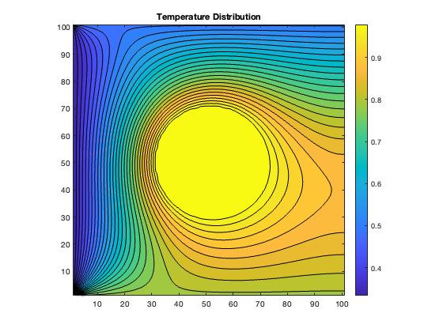
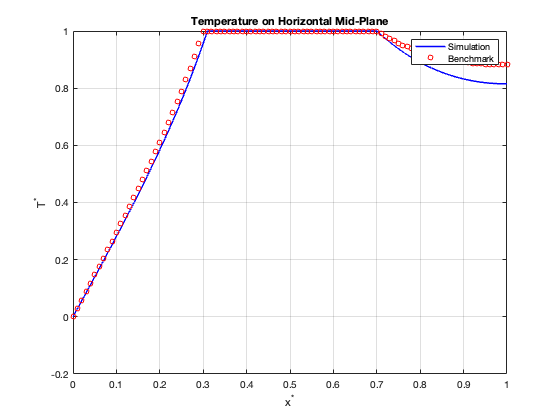
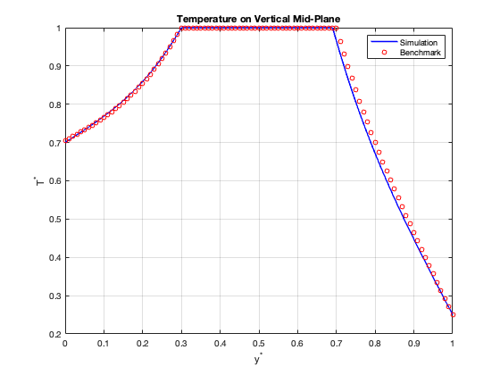

# Thermal Transport

## Description

This project implements a D2Q9 lattice Boltzmann thermal transport simulation in MATLAB. The solver models temperature transport through a square domain with an internal circular solid region, applies boundary temperature conditions, and compares horizontal and vertical centerline temperature profiles against benchmark data.

Features:
- D2Q9 thermal lattice
- MRT collision step for the thermal distribution function
- Circular immersed boundary geometry
- Wall-intersection helper for curved boundary treatment
- Temperature distribution visualization
- Horizontal and vertical benchmark comparisons

## Governing Quantities

Temperature is recovered from the distribution functions as:

T = sum(f_i) / (R rho)

The thermal equilibrium distribution is computed from:

f_i^eq = w_i rho R T

The MRT collision step transforms the distribution functions into moment space, relaxes them with the diagonal matrix `S`, and transforms them back to distribution space.

## Results

### Temperature Distribution

### Horizontal Centerline Benchmark Comparison

### Vertical Centerline Benchmark Comparison

## Files

- ThermalTransprt.m
- Project3_Benchmark Data.mat
- test_circle.m
- find_the_wall_point.m
- ThermalTrnsprt_TempDistrib.png
- ThermalTrnsprtHoriSample_Bench_vs_Sim.png
- ThermalTrnsprtVertSample_Bench_vs_Sim.png

## Skills Demonstrated

- MATLAB
- Computational Fluid Dynamics
- Lattice Boltzmann Method
- Thermal Transport Modeling
- MRT Collision Modeling
- Curved Boundary Treatment
- Benchmark Validation
